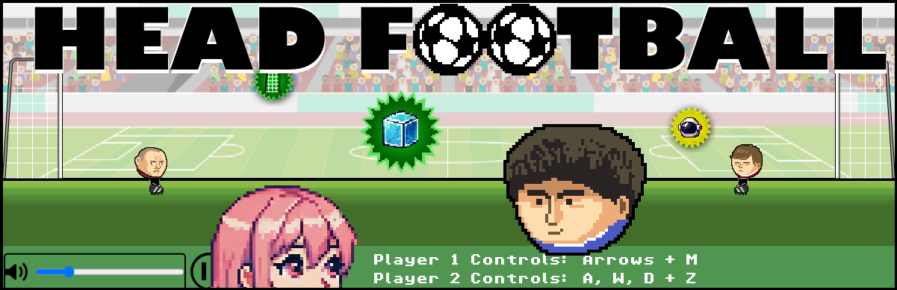

# HeadFootball

## Description
[Play Head Football](https://odimos.github.io/HeadFootball_prod/)

Head Football is a 2D browser-based web game where players compete to score goals and use fun pop up effects. You can play against another human on the same keyboard, or an AI opponent.

The game is inspired by classic Flash-era sports games, bringing that fast-paced, arcade-style experience to modern browsers. It is built exclusively with HTML, CSS, and JavaScript, using the PhaserJS library.
Τhe public repo includes only a minified version of the code.

Multimedia Technology, Athens University Of Business, 2024-2025